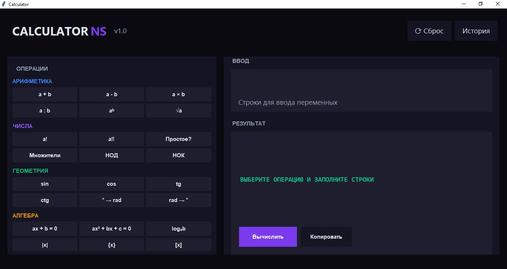
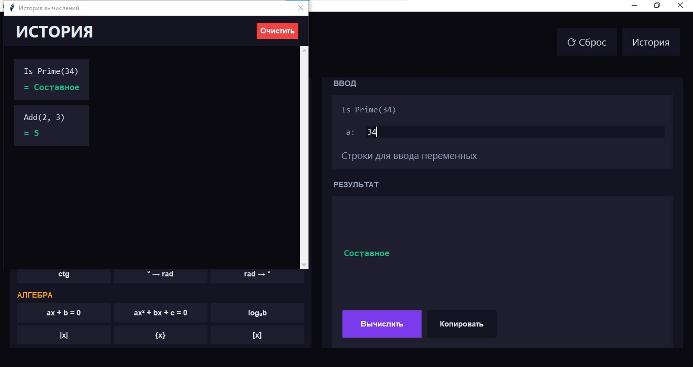

# Calculator v.1

Basic calculator – first steps in Python, Phase I.

## 💻 Project Run
- Open with Python: [Calculator_v.1.py](Calculator_v.1.py)
- Or download exe: [Calculator_v.1.exe](https://github.com/NebulaStack-prog/Calculator-v.1/releases/tag/v1.0)

## 📄 Full Documentation
- 🇷🇺  Russian version: [Documentation](Calculator_v.1_RU.md)
  
- 🇺🇲  English version: [Documentation](Calculator_v.1_EN.md)
  
## 📷 Screenshots

---

© NebulaStack
